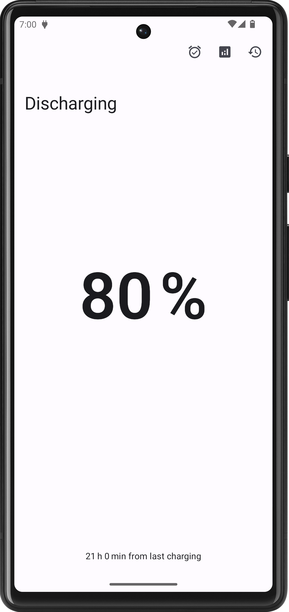
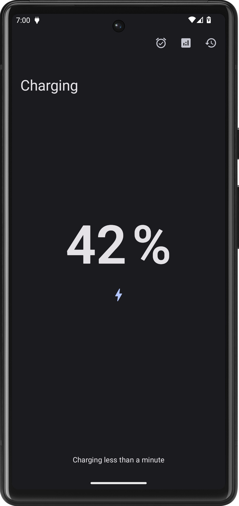
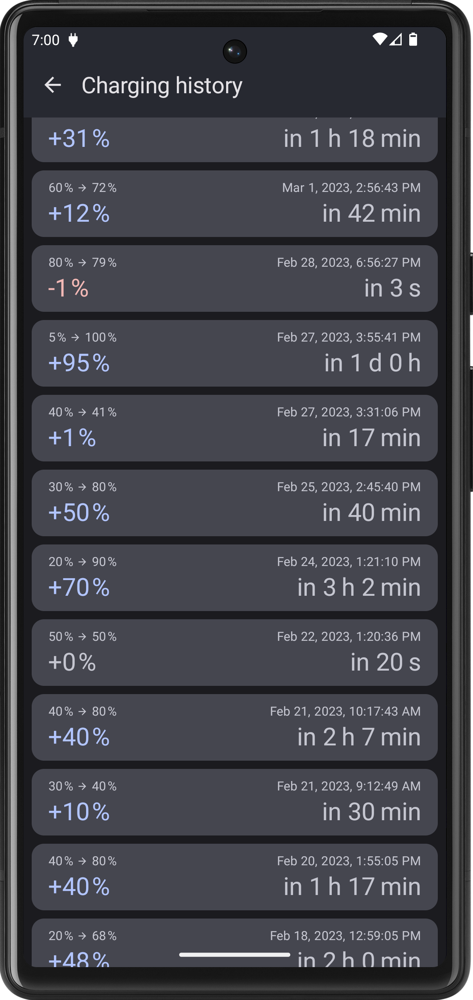
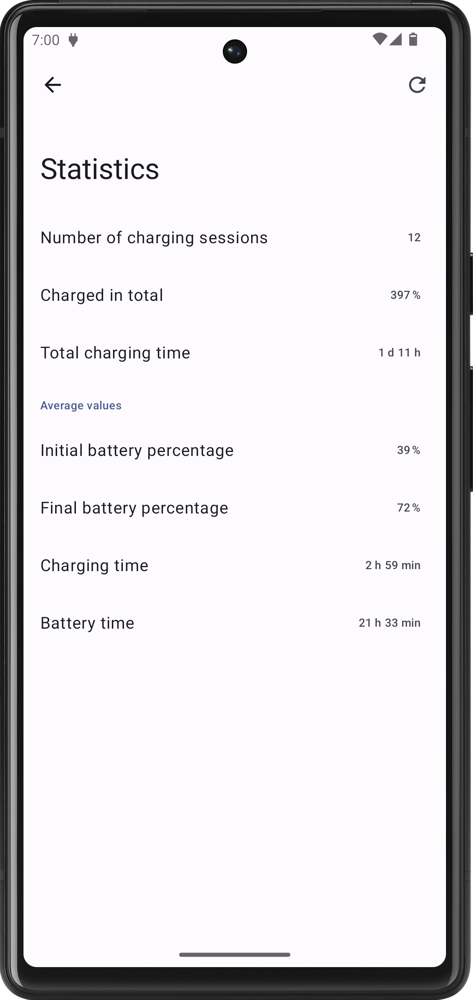
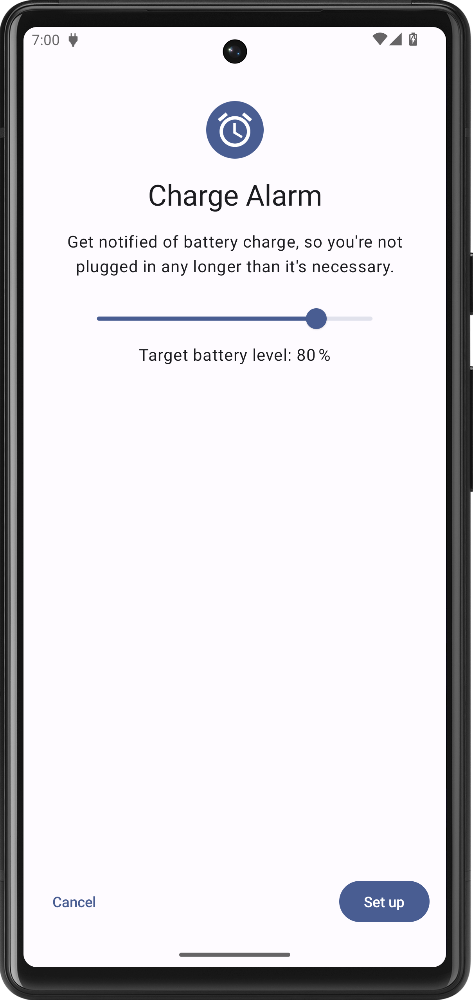

<div align="center">
  
  <h1>Charging</h1>
</div>

An Android application for monitoring your battery status and charging habits.
Written in Kotlin, built with Jetpack Compose. The application allows you to
see how you've been charging your device and to set up a charge alarm.

The
[charge alarm notification icon](app/src/main/res/drawable-anydpi/notification_charge_alarm.xml)
comes from Material icons and is available under the
[Apache License Version 2.0](https://www.apache.org/licenses/LICENSE-2.0.txt).

## Features

- uses modern toolkit: Jetpack Compose, Material Design 3 Components
- has a monochromatic icon
- provides edge-to-edge experience
- supports per-app language preferences
- checked by Detekt and lint

## Screenshots

<table>
  <tbody>
    <tr>
      <td></td>
      <td></td>
      <td></td>
    </tr>
    <tr>
      <td></td>
      <td></td>
    </tr>
</table>

## Getting started

This project uses [Gradle](https://gradle.org/) build tool and you are free to
build the application from source yourself. However, with every release a
ready-to-install APK file is provided. See
[latest release](https://github.com/bugulin/Charging/releases/latest) for the
most up-to-date version.

### Building from source

In order to be able to do a (signed) release build, you have to create a YAML
file named `keystore.yml` in the project's root directory with following content
(replace values with your own, of course):

```yaml
---
storeFile: /path/to/keystore.jks
storePassword: 'my secret password'
keyAlias: key0
keyPassword: 'my secret password'
```

Please refer to the
[Android Developers documentation](https://developer.android.com/docs) for more
information about how to build an Android project or how to create a keystore,
etc.

### Tips

If you use the Charge Alarm, try changing the notification sound (go to Settings
&#x279D; Apps &#x279D; All apps &#x279D; Charging &#x279D; Notifications
&#x279D; Charge alarm &#x279D; Sound) to something louder and longer than your
default notification sound, so that you'll never miss the alarm.

## Known issues

- The application uses many experimental APIs of Compose Material 3.
- Jetpack Compose renders a level smaller UI (e.g. Headline Medium in Large top
  app bar looks like Headline Small).
- The charging history screen hasn't been tested out with a larger number of
  items. Probably use of some pager will be appropriate.
- ViewModels shouldn't be fetching data in their init blocks. It would be better
  to use e.g. one-time side effect in a composable instead.

<sup>This project was created as a credit program for the
[Mobile Devices Programming](https://d3s.mff.cuni.cz/teaching/nprg056/)
course at MFF UK.</sup>
